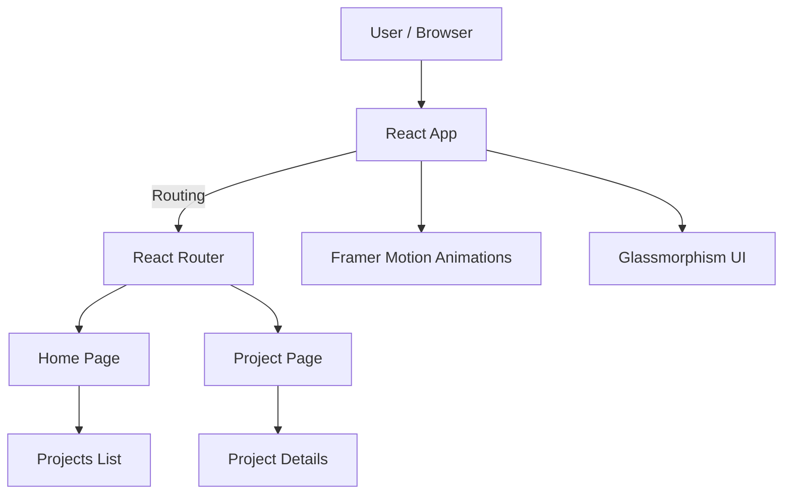

  <a href="#ru">🇷🇺 Русский</a> |
  <a href="#en">🇬🇧 English</a>

# MyLandingReact — персональный landing / portfolio 🚀

**Современный personal landing / portfolio сайт**, разработанный на **React + Vite**,  
предназначен для демонстрации проектов, стека технологий и контактов разработчика.

Сайт используется как **витрина GitHub-проектов** и развернут на **GitHub Pages**.

🔗 **Live demo:**  
👉 https://scherbalex.github.io/MyLandingReact/

---

## 🏷️ Стек и технологии

---

## ✨ Возможности

- 🌍 **Переключение языков RU / EN**
- 🎨 **Dark gradient + glassmorphism UI**
- 🎬 Анимации на **Framer Motion**
- 🧩 Отдельные страницы проектов
- 🔗 Кнопки перехода в GitHub-репозитории
- 📱 Адаптивная верстка
- 🚀 Автодеплой на GitHub Pages (CI)

---

## 🧠 Архитектура приложения

    CI[GitHub Actions] -->|build| GH[GitHub Pages]
📁 Структура проекта  
mylandingreact/  
├── public/  
├── src/  
│   ├── pages/  
│   │   ├── Home.jsx  
│   │   └── Project.jsx   
│   ├── App.jsx  
│   ├── main.jsx  
│   └── App.css  
├── .github/workflows/  
│   └── deploy.yml  
├── vite.config.js  
├── package.json  
└── README.md    
⭐ Представленные проекты
Landing агрегирует реальные showcase-репозитории:  

OnlineStore — e-commerce backend (Django, DRF, PostgreSQL)  

OnlineLearning — платформа онлайн-обучения  

Message_AutoSend — email-рассылки и планирование  

AtomicHabits API — трекер привычек + фоновые задачи  

MyBank / ProjectBank — финтех и аналитика  

HH_Data / HH_Vacancies — анализ рынка вакансий  

Каждый проект:  

имеет отдельную страницу  

содержит краткое описание  

кнопку Open repo  

🚀 Локальный запуск  
npm install  
npm run dev  
Открыть:  
👉 http://localhost:5173/  

🚀 Деплой (GitHub Pages)  
Проект автоматически деплоится через GitHub Actions:  

push → main  
  ↓  
npm run build  
  ↓  
deploy-pages  
  ↓  
GitHub Pages  
Настройки:  

base: "/MyLandingReact/" в vite.config.js  

BrowserRouter basename={import.meta.env.BASE_URL}  

📌 Назначение проекта
Этот репозиторий создан как:  

🎯 персональный landing  
 
🧰 витрина GitHub-проектов  

💼 portfolio для рекрутеров  

🧪 playground для UI / анимаций / архитектуры  

📫 Контакты
GitHub: https://github.com/ScherbAlex

Telegram: @Alex_181173

Email: alexshcherbyna1173@gmail.com

MyLandingReact — personal landing / portfolio 🚀
A modern personal landing / portfolio website built with React + Vite,
designed to showcase projects, tech stack and developer contacts.

Used as a GitHub projects showcase and deployed via GitHub Pages.

🔗 Live demo:
👉 https://scherbalex.github.io/MyLandingReact/

✨ Features
🌍 RU / EN language switch

🎨 Dark gradient & glassmorphism UI

🎬 Framer Motion animations

🧩 Project pages

🔗 Direct GitHub repository links

📱 Responsive layout

🚀 CI/CD with GitHub Actions

🧠 Architecture
(see Mermaid diagram above)

🚀 Getting started
npm install
npm run dev
🚀 Deployment
Automated via GitHub Actions → GitHub Pages

📌 Purpose
This repository serves as:

Personal landing

Project showcase

Developer portfolio

UI / animation playground

